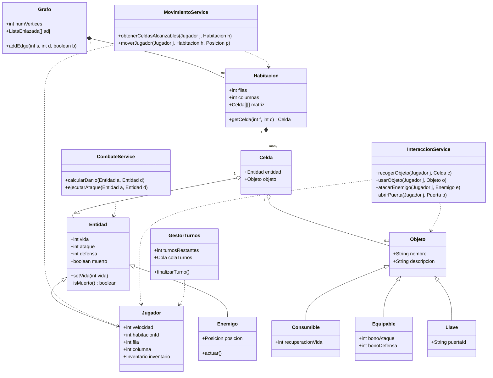
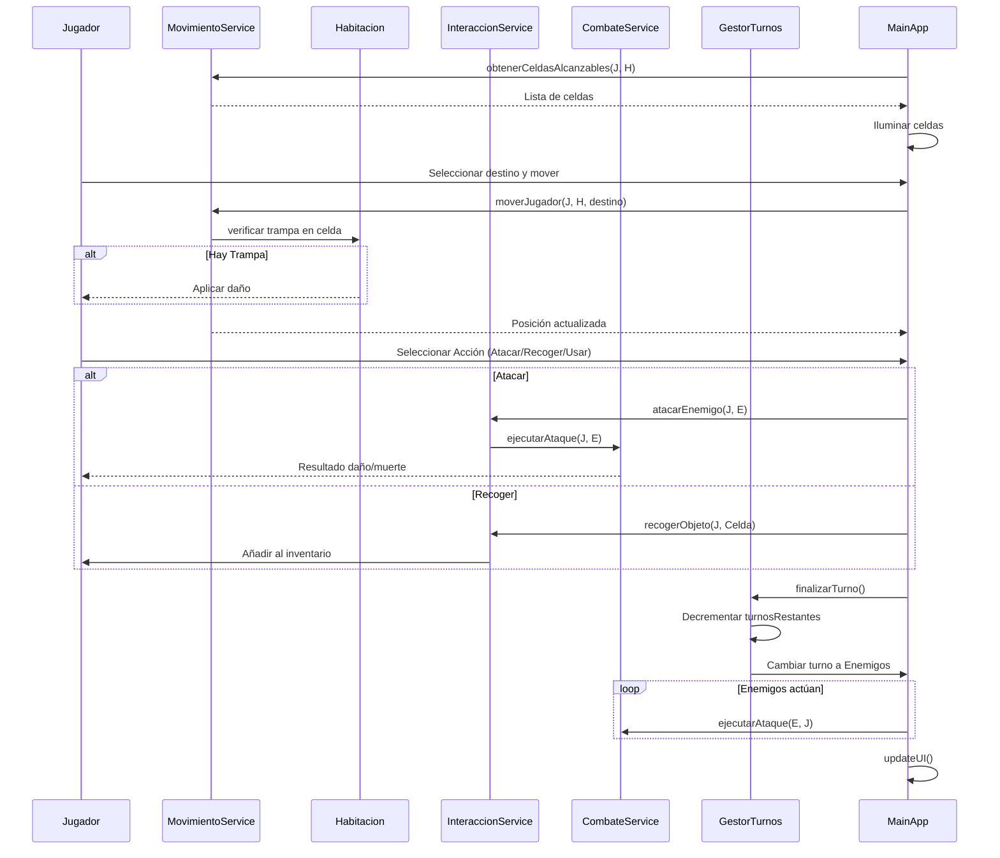

# UML del Sistema - Juego de Mazmorras

Este documento contiene las representaciones visuales de la arquitectura del sistema utilizando la sintaxis de Mermaid.js.

## 1. Diagrama de Clases

## 2. Diagrama de Secuencia (Flujo de Turno)

